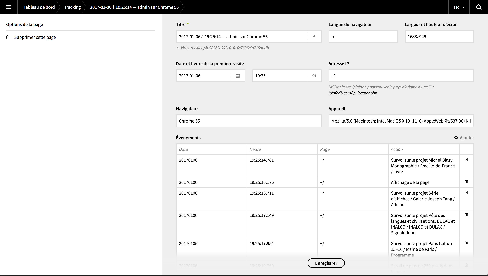

# Kirby Tracking

## How to install
Copy this repo 


  

*Version 1.1.0*

A tiny plugin for local traffic analytics in Kirby CMS.

Kirby tracking uses javascript events to identify each visitor with device information and logs all its subsequent events in a page directly accessible through the panel. 



## Installation

Use one of the alternatives below.

### 1. Kirby CLI

If you are using the [Kirby CLI](https://github.com/getkirby/cli) you can install this plugin by running the following commands in your shell:

```
$ cd path/to/kirby
$ kirby plugin:install louis-ev/kirby-tracking
```

### 2. Clone or download

1. [Clone](https://github.com/louis-ev/kirby-tracking.git) or [download](https://github.com/louis-ev/kirby-tracking/archive/master.zip)  this repository.
2. Unzip the archive if needed and rename the folder to `plugin-name`.

**Make sure that the plugin folder structure looks like this:**

```
site/plugins/kirby-tracking/
```

### 3. Git Submodule

If you know your way around Git, you can download this plugin as a submodule:

```
$ cd path/to/kirby
$ git submodule add https://github.com/louis-ev/kirby-tracking site/plugins/kirby-tracking
```

## Setup

Add the following code to your `footer.php` snippet (or copy its content to your js file):

```php
echo js('assets/plugins/kirby-tracking/assets/js/kirby-tracking.js');
```

Each visit generates a page named with the server's time for the visit, so set the timezone of your site in your `config.php`:

```php
c::set('timezone','Europe/Paris');
```

On first logging event captured, kirby-tracking will check for an existing `kirby-tracking` page. If you already have one and it wasn't created by this plugin, please remove it first or you will get blueprints mismatch and errors.

## Usage

All logs happen in javascript and can be done both with and without a type.
For example, to log a simple page load:

```js
logClientEvents('Page loaded.');
```

For each logged package, the following meta informations will be collected and sent:
- browser — name of browser and version 
- device — client's user agent
- event_page — type from which the event originated (with site url automatically replaced with ~)
- event_type — js string sent to logClientEvents (with site url automatically replaced with ~)
- lang — lang of browser
- window_size : browser innerWidth and innerHeight

## Options

### disable logged-in users tracking

You can disable tracking for logged-in users in the `tracking` page in the panel. By default, logged-in users will be identified by the name `admin` in the the title or their page. 

## Changelog

**1.0.0**

- Initial release

## Todo

- [ ] If a visitor logs in at some point in her/his navigation, move his status to admin or remove his page if option is set 

## Requirements

- [**Kirby**](https://getkirby.com/) 2.3.0+

## Disclaimer

This plugin is provided "as is" with no guarantee. Use it at your own risk and always test it yourself before using it in a production environment. If you find any issues, please [create a new issue](https://github.com/louis-ev/kirby-tracking/issues/new).

## License

[MIT](https://opensource.org/licenses/MIT)

It is discouraged to use this plugin in any project that promotes racism, sexism, homophobia, animal abuse, violence or any other form of hate speech.

## Credits

- [Louis Eveillard](https://louiseveillard.com/)

Thanks to Fabian Sperrle for the kirby-stats plugin that served as inspiration.
Thanks to Jens Törnell for the helpful [Kirby Boiler Plugin](https://github.com/jenstornell/kirby-boiler-plugin) repository.
